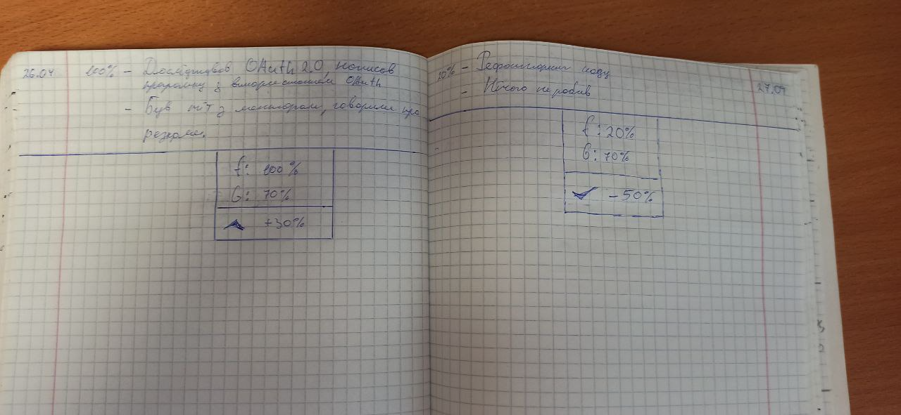
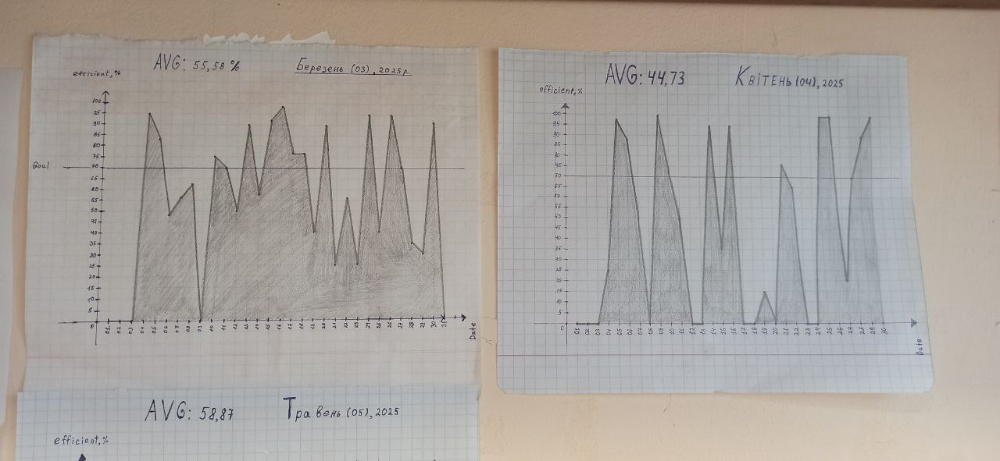
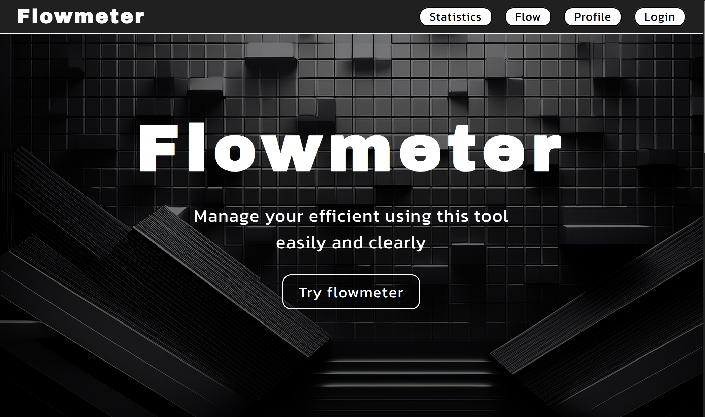
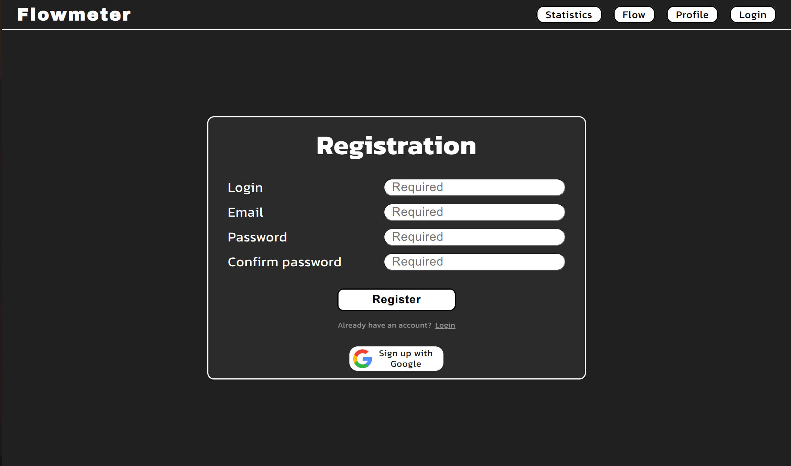
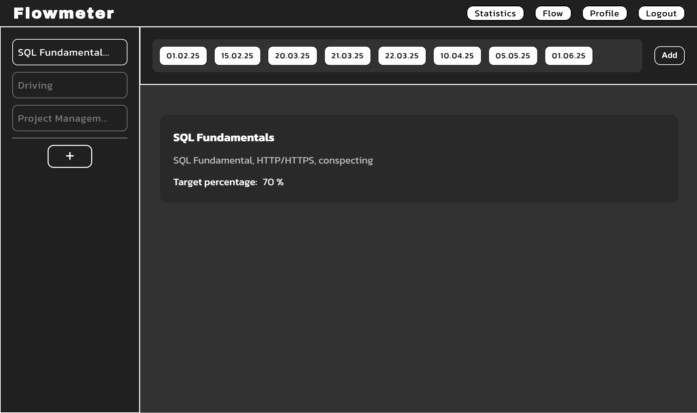
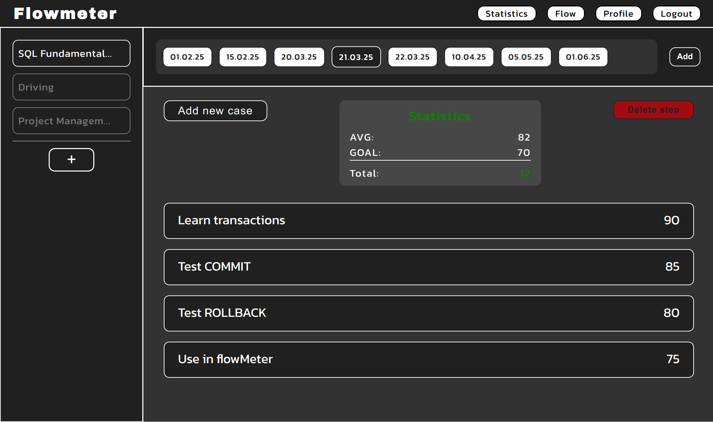
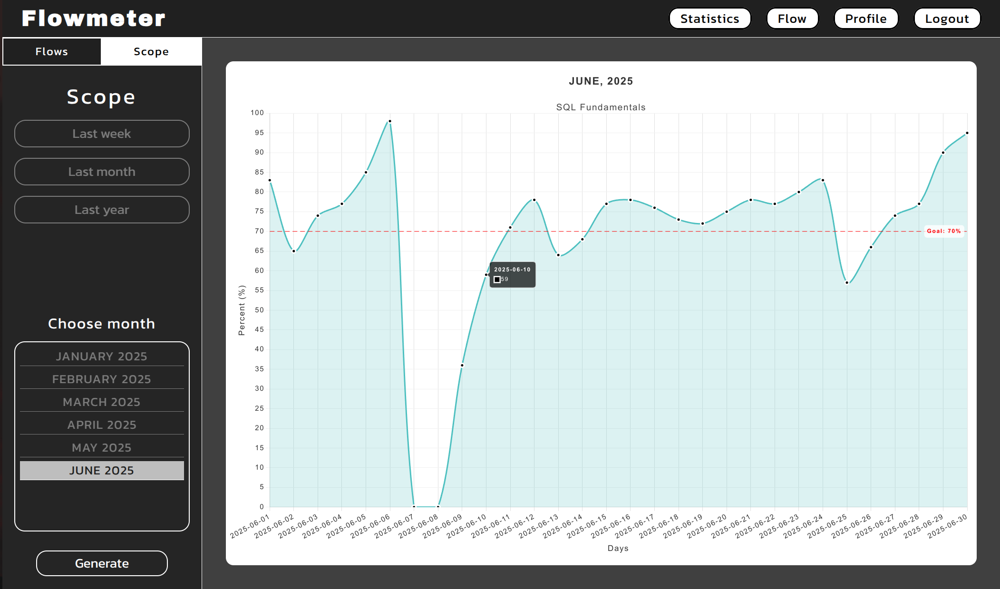

    

    
        <b><i>“Data tells you where you are, feelings tell you why it matters.”</i></b>
        <i> Unknown Author</i>
    

## 🎙 Summary
**Flowmeter** is a project that can help you to improve management of your efficient. It won't change you, it gives you a tool, where you can analyze bottlenecks in your work. This tool can show you, how many do you work
and is it possible to work harder. Maybe you already work a lot, but continue to self-flagellate.

The main idea of Flowmeter is to give you a possibility to know objectively how much you are efficient. 
You make a decision, how you will rate yourself. You can think up, what kind of rating scale you will work with. 
You make a decision, what minimum mark is ok for you.

Only, what you need to do is to keep a journal. You need to keep it every day, and rate yourself every day,
and after some period, it will be easy to see the results on the graph.

---

## 📜 Story

> My name is Bohdan Yarovyi. I am 23 years old.\
I am still a student, and I am learning and practicing a lot. I thought
that learning something it is just reading and practicing. It was a mistake.\
Mistake, cause learning programing it is like a marathon. 
It is not enough to learn one, three months, or even half of a year. 
You need to learn it always. In this situation, we need to understand 
that a usual approach does not work. It is impossible to learn it fast and efficiently
so long time. I am convinced that a lot of IT specialists know about burnout
because it is ok to get burnout in this area.
>
> During I was learning technologies like 'SQL', 'Java', 'Spring Boot' etc, 
I got burnout many times. This happened because I thought I wasn't doing enough, but in reality
It wasn't. It wasn't possible to understand this point. 
It wasn't possible to set up own work-life balance.\
I spending a lot of time every day to learn programming and wasn't sure,
that I did enough.
>
> Once, I decided that I need to create a system of objective control, 
for understanding my efficient and to struct my learning.\
I decided to write a list of cases every day that describes the things I have done.
Each case has a rate from 0 to 100 percent, it is my own point of view about 
my efficient of the specific case. At the end of the day, 
I can calculate an average and mark this rate for this day. At the end of the month,
I had a statistics of each day this month, and I can easily create a graph.
It helped me to see dependencies and patterns what affected my efficient.
>
> At that point of my life, was no idea how to manage it without a note and a pen. 
I used a simple notebook and a common pen.

    

> Two months I kept the efficiency diary. It wasn't hard at the start, because it is glad after
work to fill one more day when you were efficient. It gave effect that you do enough. 
Especially at the end of the month it is exciting to see, what result do you have.

    

> After two-month intensive study and active tracking cases, I needed to find an idea,
what project I would like to create. It was so hard to think up something interesting and what I am able to do.
Once a light bulb went on above my head, and I understand what I need to create.\
> Yes, It is a Flowmeter.

---

## 🧩 About Project
### 🔅 Main Idea

**Flowmeter** is a default web resource, where you have an account. You can get access via any Browser.

This resource allows you to enter information about completed tasks every day and measure them in percentage.
After entering tasks and their efficiency, you can calculate the overall efficiency for the day.
At any time, you can simulate graphs to display efficiency indicators in time space.

The idea is that each user will have their own account, which will become their personal space for
tracking productivity. Thanks to this approach, everyone will be able to independently manage their statistics,
adjusting them to their own needs and goals. We strive to create a convenient tool where you will have
full control over your data, from entering daily indicators to analyzing the results in a clear and visual form.
For example, users will be able to mark completed tasks, evaluate their effectiveness in percentage and see how
these indicators add up to the overall picture of productivity for the day, week or even month.
This approach allows you not only to record progress, but also to receive motivation for further improvement,
because all the tools for this will be in your hands.

The goal of the Flowmeter project is to develop a user-friendly and useful application that will help users
effectively track their productivity without complicating the process itself.
We strive to create a tool that is easy to use, yet functional, so that anyone can easily integrate it into
their daily lives. Instead of getting bogged down in complex settings or endless features, our team focuses
on keeping the process intuitive and bringing real benefits. We want Flowmeter to become your trusted assistant
in achieving your goals, allowing you to focus on what matters most — your tasks and progress — rather
than fighting the application itself.

### 🔅 User & Security

    

You can create an account via Google or just default Sign Up by entering required data. Be sure that you are entering 
valid data, because it is checking for a few layers. So, you will see a problem details if you enter something not valid.
> 📑 If you use Google Sign Up, you will be need to visit your email for receiving password.

    

### 🔅 Main Functional

The most important page in Flowmeter is "Flow". It is actually the page, which plays journal role. 
Here you are keep your notice about your daily efficient. Here you are collecting efficient`s data, 
that will be a basis for drawing graphs.

On the left side you see flows("SQL Fundamentals", "Driving", "Project Management"). A "Flow" is like direction,
where you want to move. You create a "Flow" for anything and record efficiency in this flow. Everything in your hands,
and you can... no, you need to experiment on it to know what is better personally for you.

In the picture, we can see, that "SQL Fundamentals" is chosen. So, on the right side we see the "Timeline row".
"Timeline row" is a list of all days of the chosen flow. Perfectly, you will need to create a new one every day, 
cause you will need to keep the journal every day.

    

Okay. If we click on some day, we will see a list of "cases" for this day. "Case" is a task or activity
that you can rate. You can create, update, delete such. If you need not count one, there is a check-box for it.
And it will stay there, but no effect to global graph.

Also, if you noticed, we have a statistic of the day. During you add a cases, the statistic is changing. It counts 
an average of the day and comparing with GOAL. "GOAL" is a border that you set when create a new "Flow".
> 💪 The idea is when you reach even GOAL, you are already good. You are already worked well.  

    

After a long period keeping a journal, you can go to the statistic section, and draw a graphs. You can see dynamically, 
how your efficient is changed. This is a view from above of how hard you worked and how you evaluated your diligence.

    

## 🔧 Technologies
The Application was created based on Spring-Boot.
- 🔗 Spring-Boot Web
- 🔗 Spring-Boot Data
- 🔗 Spring-Boot Security
- 🔗 Spring-Boot Validation
- 🔗 Spring-Boot Test

💾 Database is **PostgreSQL** using with **Flyway migration**.

🎭 Front-end created based on HTML, CSS, vanilla JS.

🙂 For login from Google used built-in Spring Boot Security OAuth2 flow.

## 😁👋 Me
Thank you for checking out my project!  
I am a passionate Java Developer with a strong interest in backend development.

Feel free to connect with me:
- 📭 [Gmail](mailto:bogdan.yarovoy.01@gmail.com)

**I’m always open to learning new things, collaborating on projects,
and discussing innovative ideas in the field of software development.**